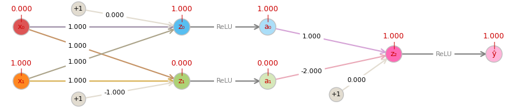

# An NN-XOR Study
<p align="center">
  
</p>


## 0. Inception
___
One day, while browsing the Internet, I came across a video describing the [NN XOR problem](https://www.youtube.com/watch?v=s7nRWh_3BtA "the NN XOR problem ( https://www.youtube.com/watch?v=s7nRWh_3BtA )"). Fascinating! And the back-propagation algorithm [<sup>(1)</sup>](#1-daniel-jurafsky--james-h-martin-neural-networks-and-neural-language-models-httpswebstanfordedujurafskyslp37pdf), awesome!  
But what happens if I block some parameters or modify them on certain points?  
Even the goals?! (You know, all your childhood your (grand)parents teach you what is wrong and what is right, but years later you realize that you have to reshape some of this 'habits'😁)  
And what if some experiences (i.e. the training samples) are not uniformly distributed, favoring some of them, like in the real world.  
Well, that's interesting. And could be kind of funny, too.   
So, *I think to myself* [<sup>(2)</sup>](#2-louis-armstrong---what-a-wonderful-world-httpswwwyoutubecomwatchvvqhcqzah4vs "Louis Armstrong - What A Wonderful World") 
... have to see that! In a [Qt](https://en.wikipedia.org/wiki/Qt_(software))("cute") way 😉


## 1. Description 
___
### A picture is worth a thousand words 
[![Full image of NN-XOR Study main window][80%]][100%]


### A few words anyway
#### Legend:
1. current (x<sub>0</sub>, x<sub>1</sub>), to check the model results :D
2. y_True = the 'truth' we want to teach (editable, not necessary XOR)
3. Probability distribution of samples in a batch. Editable (spinbox), it will automatically fill the next cells with an even distribution of the rest
4. hits: how many times the corresponding operation was generated by rng, until current position
5. *Losses curve/x* vs *global Cost* (always visible)
6. Control Panel / Turning points parameters (can be **locked**<sup></sup> for '_randomize_' / '_new model from pos_' actions)
    - seed (editable, spinbox) the initial seed for random number generator 
    - randomize the **unlocked**<sup></sup> parameters. 
      <br>-&nbsp; When pos == 0, will also randomize the weights matrix W<sup>[1]</sup> and W<sup>[2]</sup>.
      <br>-&nbsp; The weight matrix may also be affected when pos != 0 by the bounds imposed by the clip values.
      <br>-&nbsp; randomize will **never** affect the y_True!
7. Control Panel / Global parameters <br>
[![Control Panel Global Parameters][CP_GP]][CP_GP]


#### Others words:
  - tabBar: the tabs are draggable and editable
  - '_New model_' menu action will generate a complete new random model
  - '_New model from here_' will keep also the locked TP parameters from original model
  - all the docks are detachable(DblClick on title), the config could be saved/loaded via '_Global parameters_' tab,  to platform independent (ex. registry) by QSettings mechanism <br>
<!-- <sub>(use it with precaution, there are some issues there)</sub> -->
  - other global shortcuts:
    - Ctrl + R:  Randomize 
    - Ctrl + F:  Fill model from current position
    - Ctrl + Enter: set Focus to Slider
    - Ctrl + ~: collapse/expand bottom z-a panels
    - when focus on tabBar or slider:
      <br>-&nbsp; Ctrl(+Shift) + Tab: go to next/previous tab model
      <br>-&nbsp; Ctrl/Shift + Ins/Del/+/-: add new model, delete current model
  - smooth editing cells: Wheel / Key Up/Down with 
    - no modifiers: +/- 0.1 
    - Alt **or** Shift: +/- 0.01 
    - Alt **and** Shift: +/- 0.001 
    - click/drag on slider :  +/- 1, keeping decimals
  - I tried to implement some color hints, if don't get it, means I didn't make it :/

## 2. Installation
___
This project requires [Python 3.11](https://www.python.org/downloads/) or higher and depends on following libraries: 

  - PySide6 
  - PyQtGraph 
  - networkx 
  - numpy 
  - pandas 
  - matplotlib

You can install these with pip using the provided [requirements.txt](requirements.txt) file:

```bash
pip install -r requirements.txt
```

To play, go to the /src/ folder and run:

```bash 
python -m main
```

> ( **Note**: for unit-tests you need an environment with also keras and tensorflow packages, for example _"requirements for unit tests.txt"_ for Python 3.11.2 )

## 3. Final words
___
Try to figure out when a starting position is "very likely" to yield a solution (or how to hijack the trajectory towards :D)


## 4. License 
___
Copyright 2024 Daniel Lukacs, distributed under [the MIT license](LICENSE.md).

## 5. References
___
##### 1. Daniel Jurafsky & James H. Martin, Neural Networks and Neural Language Models: [https://web.stanford.edu/~jurafsky/slp3/7.pdf](https://web.stanford.edu/~jurafsky/slp3/7.pdf)
<a name="1-daniel-jurafsky--james-h-martin-neural-networks-and-neural-language-models-httpswebstanfordedujurafskyslp37pdf"></a>  

##### 2. Louis Armstrong - What A Wonderful World: [https://www.youtube.com/watch?v=VqhCQZaH4Vs](https://www.youtube.com/watch?v=VqhCQZaH4Vs)
<a name="2-louis-armstrong---what-a-wonderful-world-httpswwwyoutubecomwatchvvqhcqzah4vs"></a>  

##### 3. The NN-XOR study, in motion: [https://www.youtube.com/watch?v=5CNkplPwkKM](https://www.youtube.com/watch?v=5CNkplPwkKM)

[100%]: readme.img/main_100.png
[80%]: readme.img/main_80.png
[CP_GP]: readme.img/CP_GlobalParams.png